<!-- contribution heatmap: real data, boxes reveal cell by cell
     regenerated daily by .github/workflows/update-profile-art.yml
     scripts: fetch_contributions.py → render_heatmap_svg.py -->

<h3><code>arman@github ~ $ ./contributions.sh</code></h3>

  

<!-- hero: monochrome ASCII portrait (types in) beside the neofetch info card
     portrait: python scripts/prep_photo.py <photo> && python scripts/make_ascii_svg.py
     info card: python scripts/make_info_card.py -->

<h3><code>arman@github ~ $ whoami</code></h3>
<table>
<tr>
<td valign="top"></td>
<td valign="top"></td>
</tr>
</table>

